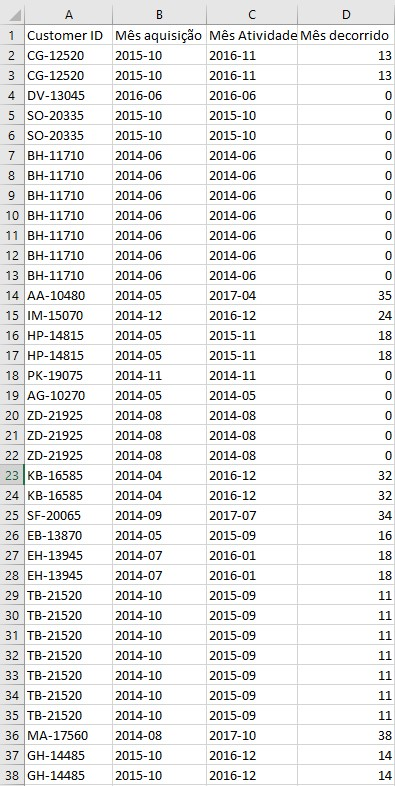
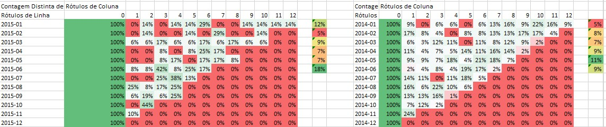
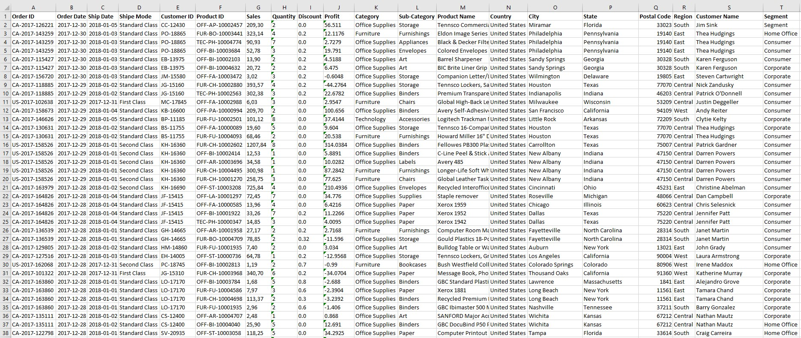
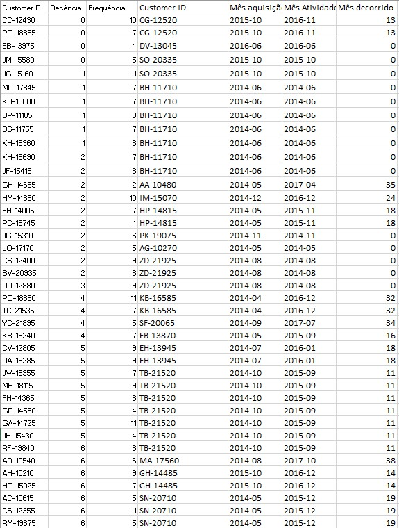
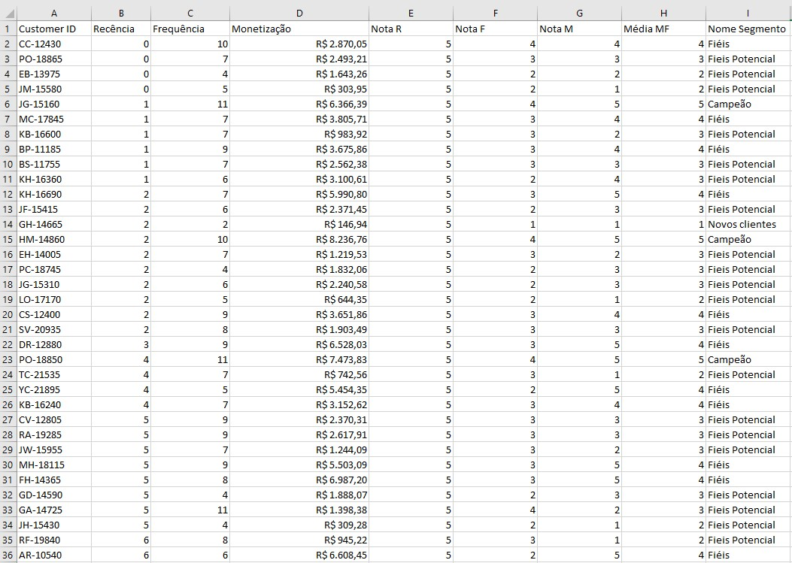
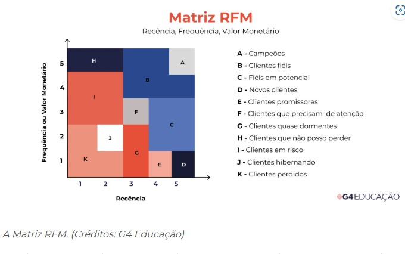
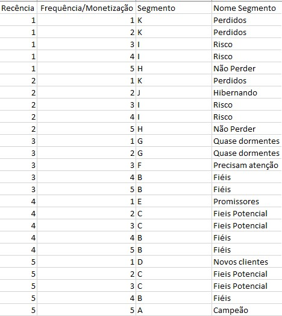
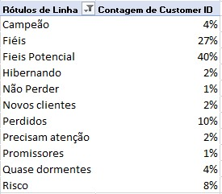
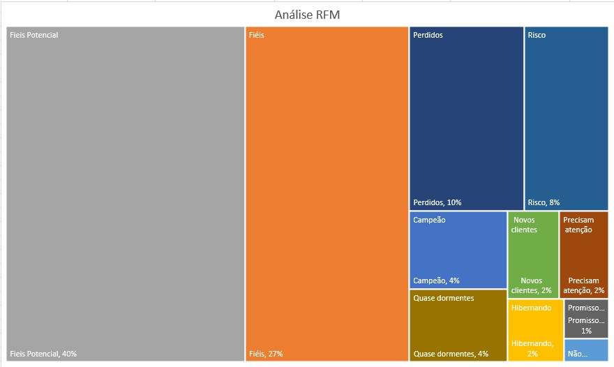

# Análise-Superstore
Retenção e classificação dos clientes 

# Problema de Negócio
A SuperStore é uma rede de supermercados com várias unidades físicas espalhadas por todo o país, com o objetivo de fornecer alimentos e comercializar
os mais diversos produtos para consumo. Recentemente, o time de dados desenvolveu uma análise de Cohort para acompanhar a retenção dos clientes da rede e revelando números bons para alguns Cohorts e ruim para outros. Como essa informação, os gerentes resolveram fazer ações distintas para grupos específicos de clientes, afim de aumentar a taxa de retenção da empresa. Porém, ele não sabem como segmentar a base de clientes em grupos e nem qual seria a necessidade para planejar a ação. 

# Contexto

Esse desafio chegou até o time de dados que precisar segmentar a base de clientes, criando grupo menores com necessidades específicas para uma ação mais precisa do time de Marketing e Produtos. O seu próximo problema de negócio é criar uma segmentação de clientes e explicar as área de negócio, como Marketing, Vendas e Produto, a necessidade de cada grupo e quais ações poderiam ser feitas para
aumentar a retenção.

# Premissas da análise

A Análise de Cohort é uma técnica analítica que agrupa indivíduos ou  eventos com características comuns durante um determinado período para observar seu comportamento ao longo do tempo. Essa abordagem ajuda a entender como diferentes segmentos de clientes ou usuários se comportam após uma ação inicial, como uma compra ou uma visita a
uma loja.

Um Cohort é um grupo de indivíduos ou eventos que compartilham uma característica comum em um determinado momento. No contexto da SuperStore, um cohort pode ser composto por clientes que realizaram sua primeira compra em um mesmo mês ou semana. A ideia é acompanhar o comportamento desses clientes ao longo do tempo para
entender sua lealdade, frequência de compras e retenção. 

A definição de um cohort depende do objetivo da análise. No caso da SuperStore, que está interessada em melhorar a retenção de clientes, os cohorts podem ser definidos com base na data da primeira compra. Por exemplo, pode-se criar um cohort de todos os clientes que compraram pela primeira vez em janeiro e acompanhar como eles continuam a comprar nos meses subsequentes. Outros exemplos de definição de cohorts incluem:
1. Data da primeira compra.
2. Data de registro em um programa de fidelidade.
3. Primeiro uso de um cupom de desconto

A Análise de Cohort permite identificar padrões de comportamento ao longo do tempo, ajudando a responder perguntas como: "Os clientes que compraram no mês X continuam comprando nos meses seguintes?", "Qual é a taxa de retenção ao longo dos meses?", "Em qual momento os clientes começam a abandonar a SuperStore?" No contexto de retenção de clientes, a função da Análise de Cohort é mostrar se e quando os clientes estão deixando de comprar, permitindo à SuperStore implementar estratégias para melhorar a fidelidade e reduzir a perda de clientes.

a. Coletar dados: Organize os dados de compras de clientes em uma tabela no Excel. Certifique-se de incluir a data da primeira compra de cada cliente, assim como suas compras subsequentes.
b. Definir cohorts: Crie colunas que agrupem os clientes com base na data da primeira compra. Por exemplo, crie uma coluna para o mês em que o cliente fez sua primeira compra.
c. Montar a tabela de cohort: Crie uma tabela que mostre os clientes agrupados por mês de primeira compra e o comportamento de compra nos meses subsequentes. Cada linha representará um cohort (por exemplo, clientes de janeiro), e cada coluna representará o número de meses após a primeira compra (Mês 1, Mês 2, Mês 3, etc.).
d. Calcular a retenção: Preencha a tabela calculando a porcentagem de clientes que continuaram comprando nos meses seguintes, em relação ao total inicial de cada cohort.
e. Visualizar os dados: Crie gráficos para visualizar o comportamento dos cohorts. Um gráfico de calor (heatmap) é uma ótima maneira de visualizar os dados, destacando claramente os padrões de retenção.
f. Analisar os resultados: Interprete o gráfico, buscando identificar quando os clientes começam a abandonar e quais cohorts apresentam maior ou menor retenção.

Análise Descritiva:
Recência: Coluna “Order Date” - Tempo desde a última compra
Frequência: Coluna “Order ID” - Quantidade de pedidos comprados
Monetização: Coluna “Sales” - Soma de todos os produtos comprados

(Coluna, Dimensão, Descrição)
Order Date - Tempo - Quando aconteceu?
Ship Data - Tempo
Ship Mode - Entrega - Como foi entregue?
Sales - Produto - O que foi comprado?
Quantity - Produto
Discount - Produto
Product -  Produto
Use Id - Cliente - Quem comprou?

Combinação Fato-Dimensão
1. Quantidade de Pedidos por Data ( Dia, Mês, Ano, Semana, Feriado )
2. Quantidade de Pedidos por Data de Envio ( Dia, Mês, Ano, Semana, Feriado)
3. Quantidade de Pedidos por Tier de Preço ( Baixo, Médio, Alto )
4. Quantidade de Pedidos por Quantidade de Itens
5. Quantidade de Pedidos por Tier de desconto ( Baixo, Médio, Alto )
6. Quantidade de Pedidos por Produto
7. Quantidade de Pedidos por Clientes ( Frequência )
8. Quantidade de Pedidos Por Data e Tier de Preço
9. Quantidade de Pedidos Por Data e Quantidade de Itens
10. Quantidade de Pedidos por Data e Produto
11. Soma do preço de todos os pedidos realizados por Cliente ( Monetização )
12. Quantidade de Pedidos por Data e Clientes
13. Quantidade de Pedidos por Data de Envio e Tier de Preço
14. Quantidade de Clientes (Fato) que fizeram um novo pedido (Order Date) nos meses seguintes a partir da primeira compra (Order Date)
15. Tempo em dias desde a última compra por Cliente ( Recência )

Os 3 passos do SAPE
Passo 1: Determinar a Saída: 
Tabela>Customer ID, Recencia,Frequencia, Monetizacao, Nome do Segmento

Passo 2: Planejar o Processo
1. União das tabelas

2. Criar a tabela de Segmentos
3. Dar as notas para a Recência
4. Dar as notas para a Frequência
5. Dar as notas para a Monetrização 
6. Combinar Frequência e Monetização
7. Atribuir cada usuário para um segmento

   
8. Interpretar o resultado

   

Passo 3: Identificar as Entradas
1. Fonte de Dados:
a. orders.csv → Mês de Aquisição | Atividade | Mês Corrido
b. customer.csv → Customer ID
c. product.csv → Detalhes dos produtos
d. location.csv → Detalhes da localização

# Conclusão

## Cohort: Meses de Maior e Menor Retenção
Considerando 6 meses de maturação, o melhor cohort do ano de 2014 é o mês de maio com retenção de 11%.
Considerando 6 meses de maturação, o melhor cohort do ano de 2015 é o mês de junho com retenção média de 18%. 
Com isso podemos perceber um aumento de 7% de retenção ao comparar os 6 primeiros meses de cada ano.
Considerando 1 mês de maturação o melhor foi em agosto de 2015 com 25% de retenção, 1% a mais do que o melhor cohort de 2014 que foi em novembro com retenção de 24%.
Em ambos os anos de 2014 e 2015 obtiveram a menor retenção média de 5% para os meses de janeiro e fevereiro respectivamente. 

Fatores sazonais podem impactar significativamente a retenção de clientes de uma empresa. Essas variações cíclicas afetam diretamente o comportamento de compra, a experiência do cliente e a estabilidade financeira do negócio.
Principais fatores sazonais: datas comemorativas e eventos especiais, férias e períodos de baixa atividade, oscilações econômicas e comportamento do consumidor, mudanças climáticas e estações do ano. 
Considerando esses fatores, observando a baixa retenção da SuperStore especialmente no início de cada ano, é essencial adotar estratégias como: promoções exclusivas de virada de ano, criar programas de fidelidade e recompensas, cupons de descontos para recompras.
Implementando essas estratégias, A SuperStore pode não apenas aumentar a retenção nos primeiros meses do ano, mas também estabelecer uma base sólida de clientes fiéis ao longo do tempo.

## RFM: Segmentos de Clientes Prioritários
Campeões:
Identificamos 4% dos clientes como “Campeões”, caracterizados por
compras frequentes, valores elevados e recência baixa (última compra
recente).

Clientes em Risco:
Cerca de 8% dos clientes estão neste segmento, com alta recência e
baixa frequência de compras. 

Fieis Potencial:
40% de nossos clientes estão com pedidos recentes em alta, porém seu ticket médio está baixo.

Recomendação:
Para os “Campeões”, ofereça benefícios exclusivos, como acesso antecipado a promoções e programas VIP.

Para os “Clientes em Risco”, implemente estratégias de reativação,como cupons de desconto ou comunicação personalizada.

Para os “Fieis Potencial”, promoções com combos/kit de produtos que se complementam devem ajudar a aumentar o ticket médio do cliente.

